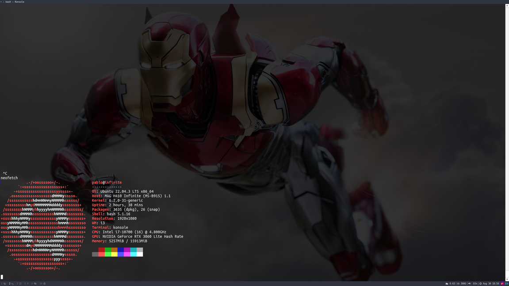

# Dotfiles 

These are my dotfiles. I use these across a few **ubuntu** computers with a few modifications. Do not copypaste blindly.

## Usage


#### Dotfiles

You can either replace your system's files or read and paste the bits in here that interest you. My canonical setup method uses `stow`.

Here's an example to stow i3 into your system.
```bash
cd ~
git clone https://www.github.com/pabsan-0/dotfiles
cd dotfiles

stow i3
```
#### Software setup

- Applications: Installed from text files. The command to be used is commented at the top of each packages.*.txt files
- Browser extensions: Installed via GUI. A script will open the extension URLs, then I simply click on them.

Here's how I would install all my SW:

```bash

# Apt and snap packages. Snap may fail due to --classic flags
sudo apt install $(sed "s/#.*//g" packages.apt.txt  | xargs)
sudo snap install $(sed "s/#.*//g" packages.snap.txt  | xargs)

# Firefox extensions. This opens a few tabs which need interaction
firefox $(sed "s/#.*//g" packages.ffext.txt  | xargs)
```

## First time setups

Here's a todo list when using these on a new system:
- Install software from text files
- Stow all dotfiles
- If using i3:  
    - Log out and back in
    - Check i3 works in general - it usually will
    - Check i3blocks are working - more prone to conflicts
- Handling credentials:
    - Password manager and extensions
    - Set git user and email automtically


## Notes

- Packages
    - Readable list / installation
    - App extensions: vscode, vim, firefox
- Tmux conf
    - Test usable one
    - See Primeagean for reference
- Vim conf
    - Test usable
    - See Primagean AND booker especially https://github.com/bookercodes/dotfiles/tree/ubuntu
    - Research plugins and linters
    - Markdown support
- i3 conf
    - Branch for laptop
    - i3blocks --- but for later since laptop requires a few more
- Rofi
    - window menu: kill apps
    - navigate with ctrl+hjkl
- Bash
    - See ideas from zsh
    - Unclutter current default  
    - Customise Shopts, expansions, caps...
    - fzf and shortcuts
    - Retrieve previous output
    - .inputrc





## Issues

- Whatsapp - or other chrome apps - wont yield notifications until manually clicked by the user, among other issues.
    - Try assigning the windows with weirdo appnames by hand rather than all this junk.
    - Use chrome://apps rather than specific sites, more flexible / non compulsary login
    - Enable notifications in the app?
- Dunst uses the Ctrl+` that i use in vscode and i dont know how to remove it

- For better ^Z
    - https://superuser.com/questions/378018/how-can-i-do-ctrl-z-and-bg-in-one-keypress-to-make-process-continue-in-backgroun
- Screen timeout while watching video
- Compton issues: 
    - Bad value etc.  -> `sudo usermod -a -G video $USER`
    - The above fix didnt last too long... migrate to picom 