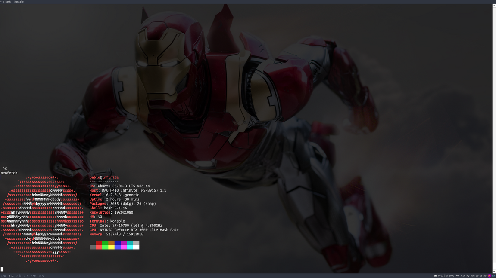

# Dotfiles

These are my dotfiles. I use these across a few **ubuntu** computers with a few modifications. Do not copypaste blindly.

#### Install
```bash
cd ~
git clone https://www.github.com/pabsan-0/dotfiles
cd dotfiles

./installs.bash           # Install apt+snap+git packages
./installs_brave.bash     # GUI interactive browser extension installs
./stow.bash bash vim i3   # Stow using the helper file

sudo chmod +s $(which brightnessctl) # Allows brightness controls from i3
vim +PlugInstall +qall    # Once vim is installed and dotfiles in place, install plugins
gnome-session-quit        # Log out and back in for i3, then verify i3+i3blocks (battery, date, volume...)
```

#### Diagnose
```bash
dotfiles-edit             # opens $EDITOR at the dotfiles dir
dotfiles-monitor          # Checks all dotfiles symlinks status
dotfiles-bash-functions   # New bash functions imported at the shell
ls bash/bin               # New executables available to the shell in PATH
```

#### See also

- [Components](.docs/Components.md)
- [Issues](.docs/Issues.md)


<br>
<br>

